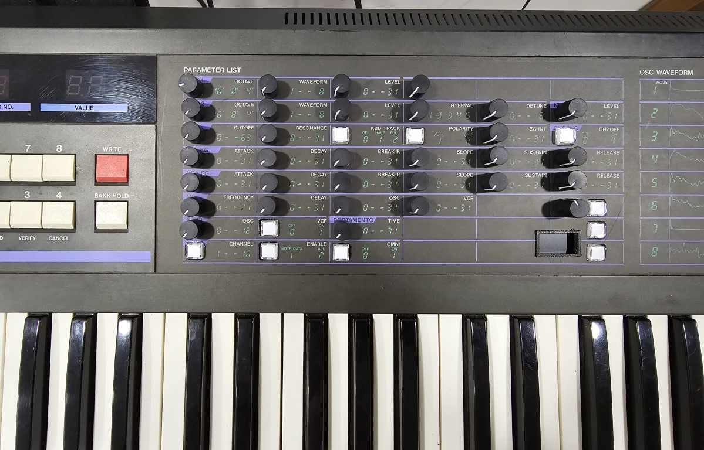

# Korg-DW6000-editor
A built in sysex editor for the Korg DW6000 wavetable synthesizer

I picked up a broken Korg DW6000 for £100 a few months back, fixed it fairly quickly with a broken logic chip.

Back in the 80's I wrote an editor for the DW on my Amstrad CPC 6128, well computers have come a long way since then and a Teensy 4.1 probably has more power than the CPC6128 and certainly more RAM.

So I thought it would be good to build a hardware editor directly into the synth for each parameter and store them in memory. Also add an OLED display to show what is being edited.

Upgraded the DW6000 with the 128 waveform mod in banks of 8. Unfortunately the parameter 14 currently doesn't change over MIDI, developers say it was never really tested and it was done a while back. I'm in no position to fix it, so it sort of negates the 128 waveform expansion from the editor. You can still edit from the synth and maybe a fix will come along, who knows.

The editor board was a sandwich of proto board to get the spacing almost right to fit the pots where the numbers were for each parameter, everything is mounted on a single board and intercepts the incoming MIDI and adds usbMIDI support. Plus each parameter is now mapped to an incoming CC message for easier editing from a DAW etc.

* 999 Memories.
* USB to MIDI conversion.
* CC message control.
* Master control sends all params for each patch from memory to the DW.
* Slave mode, edits the DWs own patches.
* Reload of factory patches from the settings menu.
* Dump of current patch as a sysex file over MIDI to receiving device.
* Dump all patches over MIDI as sysex files (64) to receiving device.
* 128 waveform mod support with Param 14 (currently not working from pot, but param is stored).
* Receives a Sysex Patch over MIDI and loads it into the Synth and editor

# CC to Sysex conversion

osc1_octave 10
osc1_waveform 11
osc1_level 12

osc2_octave 13
osc2_waveform 14
osc2_level 15
osc2_interval 16
osc2_detune 17
noise 18

vcf_cutoff 74
vcf_res 71
vcf_kbdtrack 21
vcf_polarity 22
vcf_eg_intensity 23
chorus 93

vcf_attack 25
vcf_decay 26
vcf_breakpoint 27
vcf_slope 28
vcf_sustain 29
vcf_release 30

vca_attack 31
vca_decay 32
vca_breakpoint 33
vca_slope 34
vca_sustain 35
vca_release 36

mg_frequency 37
mg_delay 38
mg_osc 39
mg_vcf 40

bend_osc 41
bend_vcf 42
glide_time 43

wave_bank 44

poly1 47
poly2 48
unison 49

  

  
